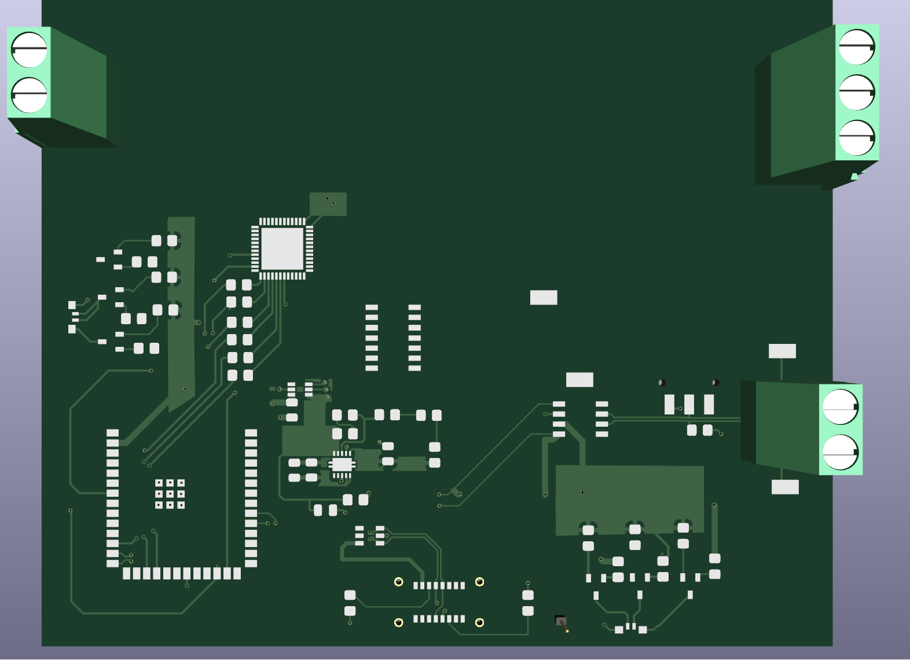

# CANDrive32
A BLDC Motor ESC Development Board with CAN functionality

Current Status
1. Schematic: v0.91, Validation Pending
2. Layout: Work In Progress, Validation Pending
3. eBOM: Passive Component decision pending
4. Costing: Critical Components Complete

This ESC is intended to be a development board and a platform for learning motor control, it is being designed with CAN functionality integrated, a MPWM IN Support and leverages ESP32 to enable wide modes of control.

This ESC is intended to be compatible with a wide variety of Motor Control Methods from FOC to Trapezoidal, the intention is to support both sensor anmd sensorless methods albeit the sensored method requiring external Hall Sensors.

This ESC Also demonstrates usage of ideal diode for power selection purposes.

If you have any correction in the schematic please contact me!

[3D VIEW: Work In Progress]

